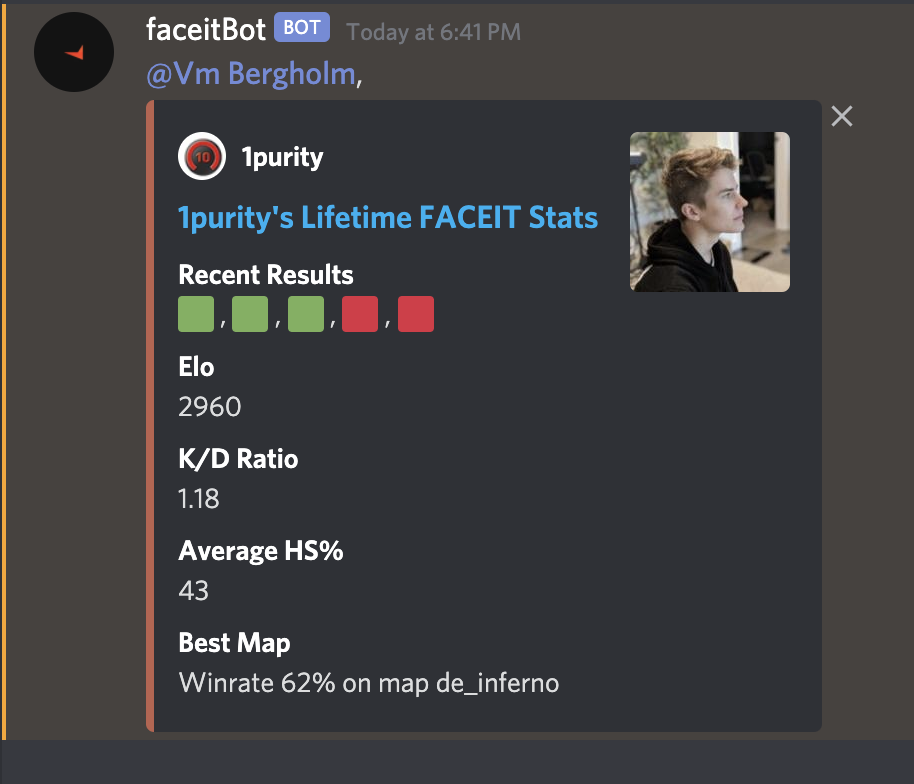
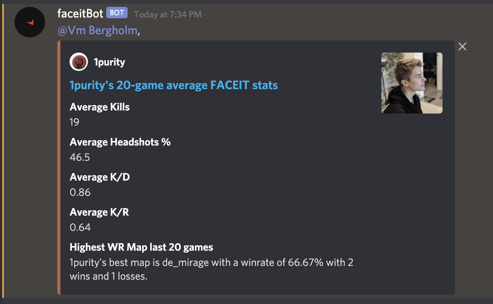
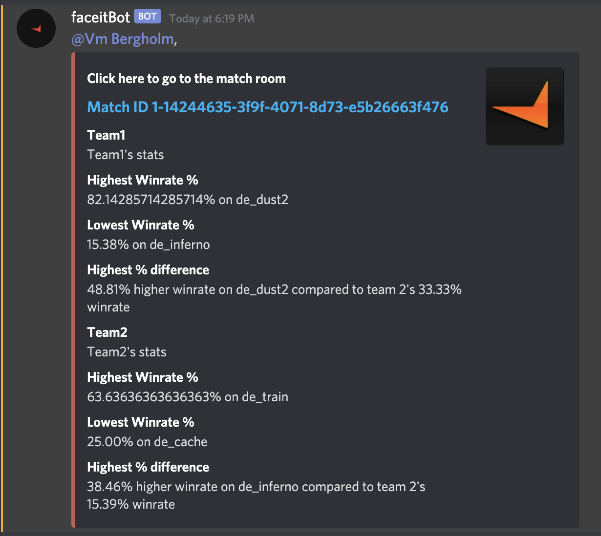

# FACEIT Discord Bot
FaceIt Discord Bot allows you to retrieve player and match statistics.

## Currently Implemented
.stats [playerName] - retrieves FaceIt lifetime statistics of the player
.stats20 [playerName] - retrieves FaceIt statistics of the player over the last 20 games
.matches [matchId] - Calculates the last 20 matches of each player and suggests which map to pick

## Examples
- .stats [playerName]

  
  

- .stats20 [playerName]

  
  

- .matches [matchId]

  
  

## Upcoming
- Match information - .match to see the scoreboard
- ADR and nade damage and other statistics through leetify or other service once they have an API
- Ability to link your discord and faceit accounts to ease getting stat updates
- Automated match detection - sends you .match information once the queue pops

## Considerations
With the increasing success of https://www.reddit.com/r/GlobalOffensive/comments/j4f8vr/discord_10man_pug_bot/, I might migrate to a python bot to ease combining these two.
